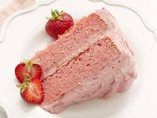

### This is a LOCAL change :)

# My favourite receipt: Strawberry cake
line 2 changed remotely
### Edited by Mianne Lee

This strawberry cake is easy to make from scratch with **strawberry puree** and **strawberry gelatin**.

* Prep Time:
15 mins
* Cook Time:
25 mins
* Additional Time:
10 mins
* Total Time:
50 mins
* Servings:
14
* Yield:
1 2-layer 9-inch cake

<em>URL: https://www.allrecipes.com/recipe/60564/strawberry-cake-from-scratch/<em>

last line changed locally

